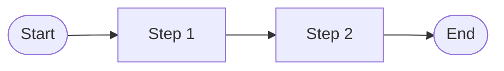
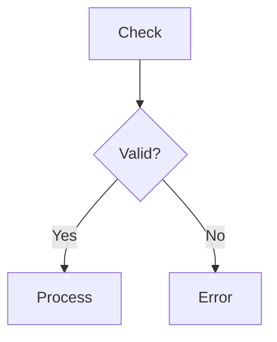
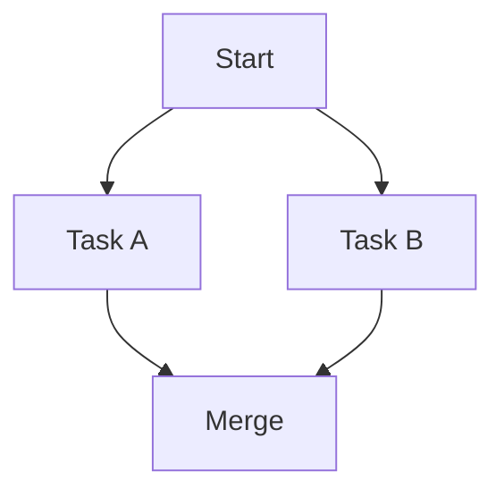

# 🔀 Process Flow — BPMN Patterns & Mermaid Syntax

## 1. Mermaid Flowchart Conventions

```
Start/End:    ([Bắt đầu]) / ([Kết thúc])
Process:      [Bước thực hiện]
Decision:     {Điều kiện?}
Subprocess:   [[Sub-process]]
Database:     [(Database)]
Document:     >Document]
```

## 2. Common Flow Patterns

### Linear Flow


### Decision Branch


### Parallel Paths


## 3. Quy Trình Phân Tích

1. **Xác định Scope:** Trigger + Actors + Outcome
2. **Vẽ AS-IS:** Flowchart hiện tại + Pain points ⚠️
3. **Vẽ TO-BE:** Flowchart cải tiến + Highlights ✅
4. **So sánh:** Bảng Before/After + ROI

## 4. Checklist Quality

- [ ] Đúng 1 Start, ít nhất 1 End
- [ ] Mọi Decision đều có ≥ 2 nhánh
- [ ] Không có dead end (node không đi đâu)
- [ ] Không quá 15 bước (split nếu vượt)
- [ ] Exception/error paths có mặt
- [ ] Thời gian ước lượng cho mỗi bước (nếu biết)
